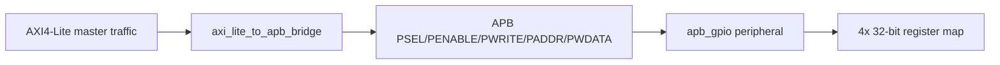
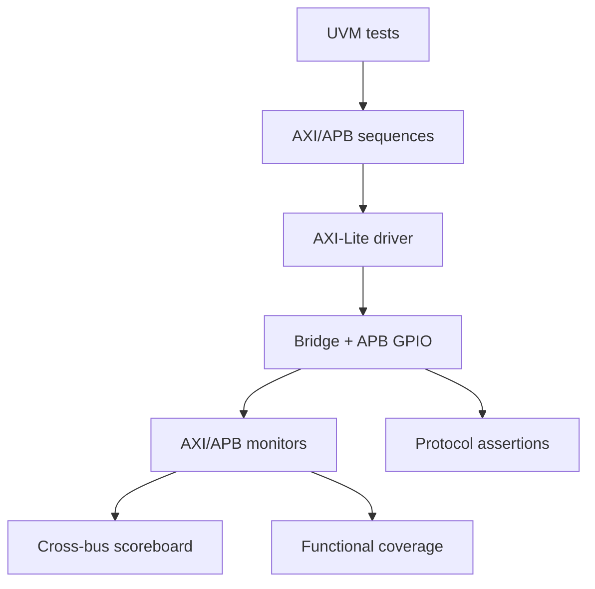

# AXI4-Lite to APB UVM Verification Platform


## Recruiter Quick View

| Item | Evidence |
|---|---|
| Role target | Digital / Functional Verification Intern, Junior DV, RTL Verification |
| What is verified | AXI4-Lite to APB bridge and APB GPIO-style peripheral access |
| Verification method | vPlan-driven UVM environment, scoreboard plan, SVA/protocol checks, coverage model |
| Reusable skills shown | SystemVerilog, UVM structure, AMBA AXI4-Lite/APB, assertions, functional coverage, regression discipline |
| Run command | `pwsh scripts/run_regression.ps1 -Simulator vcs` or `-Simulator xcelium` with commercial tools |
| CI status | Open-source RTL lint only; full UVM requires VCS/Xcelium/Questa |
| Limitations | This repo does not claim closed numeric coverage until a commercial simulator coverage DB is archived |

## Why This Project Exists

This is the capstone portfolio project tying together the smaller AXI4-Lite, APB, and FPGA labs. The goal is not to add another toy block; the goal is to show a verification workflow an engineer can inspect quickly:

1. read a requirement,
2. map it to tests and coverage,
3. run regressions,
4. inspect failures and bug notes,
5. understand what is already proven and what still needs commercial-tool closure.

## Design Under Test



## Verification Architecture



## Evidence Map

| Artifact | Link |
|---|---|
| Verification plan | [`docs/vplan.md`](docs/vplan.md) |
| Register map | [`docs/register_map.md`](docs/register_map.md) |
| Regression summary | [`sim_results/regression_summary.txt`](sim_results/regression_summary.txt) |
| Coverage summary | [`docs/coverage_report.txt`](docs/coverage_report.txt) |
| Bug log | [`docs/bug_log.md`](docs/bug_log.md) |
| RTL file list | [`filelist.f`](filelist.f) |
| Regression script | [`scripts/run_regression.ps1`](scripts/run_regression.ps1) |
| CI workflow | [`.github/workflows/ci.yml`](.github/workflows/ci.yml) |

## Planned Regression Matrix

| Test | Purpose | Status |
|---|---|---|
| `bridge_smoke_test` | Reset, one AXI write, one AXI read through APB | Implemented skeleton |
| `bridge_random_rw_test` | Random aligned register reads/writes | Implemented skeleton |
| `bridge_error_test` | Decode invalid APB address and check error response | Implemented skeleton |
| `bridge_wait_state_test` | APB wait-state handling while AXI channel is stalled | Implemented skeleton |

## Repository Layout

```text
rtl/                         synthesizable DUT blocks
tb/if/                       SystemVerilog interfaces and protocol checks
tb/uvm/                      UVM package, env skeleton, tests, coverage, scoreboard
docs/                        vPlan, register map, coverage summary, bug log
sim_results/                 text evidence from archived/planned regression runs
scripts/run_regression.ps1   simulator entrypoint for VCS/Xcelium/Questa-style flows
```

## How to Run

Commercial UVM simulator:

```powershell
pwsh scripts/run_regression.ps1 -Simulator vcs -Test bridge_smoke_test
pwsh scripts/run_regression.ps1 -Simulator xcelium -Test bridge_random_rw_test
```

CI/open-source check:

```bash
verilator --lint-only -sv -Wno-fatal --top-module axi_lite_to_apb_bridge rtl/axi_lite_to_apb_bridge.sv
verilator --lint-only -sv -Wno-fatal --top-module apb_gpio rtl/apb_gpio.sv
```

## Honest Status

- RTL bridge/peripheral and UVM verification architecture are present.
- vPlan, coverage intent, scoreboard intent, and regression commands are documented.
- CI is intentionally RTL-lint-only because open-source simulators do not fully cover UVM class-based verification.
- Numeric coverage is not claimed until a real simulator coverage database is archived.

## Interview Talking Points

- How AXI4-Lite VALID/READY maps to APB SETUP/ACCESS phases.
- Why write response timing must wait for APB completion.
- How a scoreboard correlates AXI transactions with APB register state.
- Which coverage bins prove address, direction, response, wait-state, and reset behavior.
- Why the project separates CI lint evidence from full commercial UVM regression evidence.


